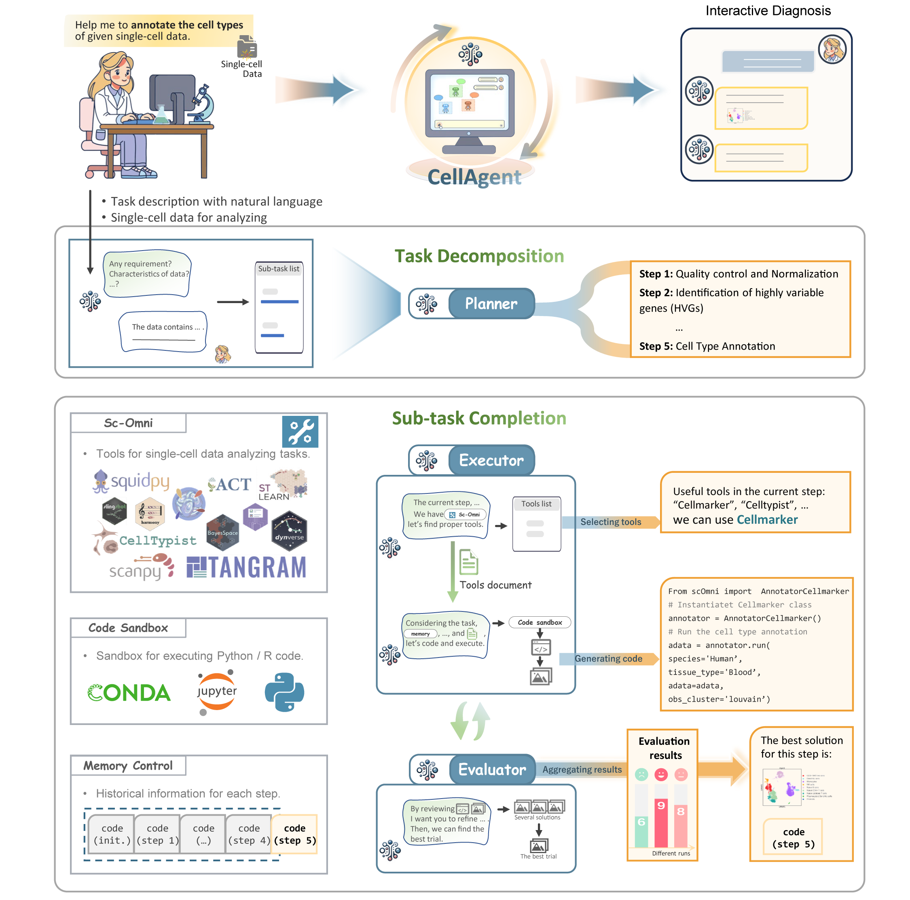
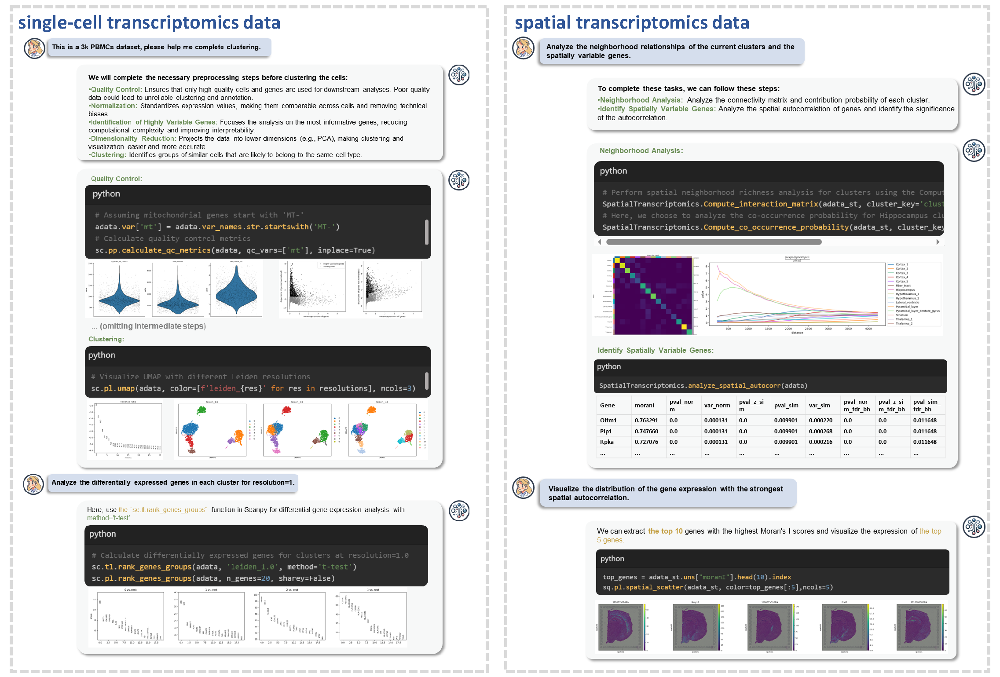
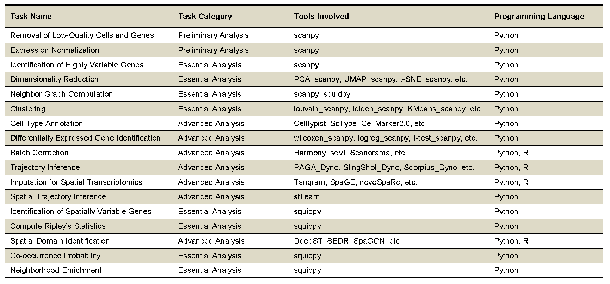

## CellAgent: Autonomous scRNA-seq and Spatial Transcriptomics Data Analysis

**CellAgent** is a novel **Large Language Model (LLM)**-driven autonomous approach designed to perform end-to-end **single-cell RNA sequencing (scRNA-seq)** and **spatial transcriptomics (ST)** data analysis through **natural language interactions**.

### Key Features

* **Autonomous Analysis:** Employs a multi-agent hierarchical decision-making framework, simulating a "deep-thinking" workflow to ensure analytical steps are logically coherent.
* **Natural Language Interface:** Researchers interact by translating high-level scientific questions into optimized computational workflows.
* **High-Performance Toolkit:** Integrates **sc-Omni**, an expert-curated toolkit that consolidates essential tools for scRNA-seq and ST analysis.
* **Self-Reflective Optimization:** Introduces an automated, iterative refinement mechanism using specialized evaluation methods, effectively replacing traditional manual assessments.

### Benefits

* **Significant Efficiency Gains:** Achieves significant improvement in efficiency across multiple applications while maintaining excellent performance comparable to existing approaches.
* **Lowered Technical Barriers:** Dramatically lowers technical barriers in bioinformatics, serving to **democratize** the scientific discovery process in genomics.

***

**CellAgent** represents a step toward a new, more accessible paradigm in bioinformatics, allowing researchers to perform complex data analyses **autonomously**.

  

<!-- 

  

  

 -->

