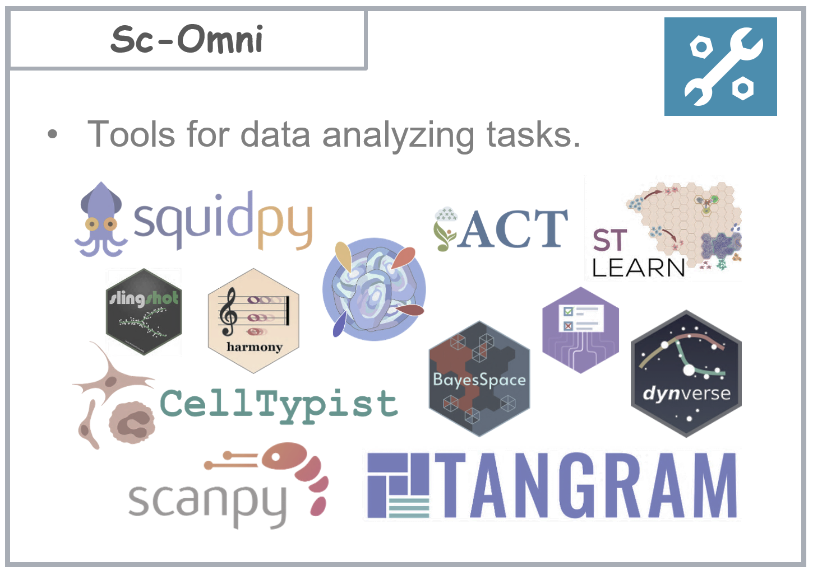

# sc-Omni

**sc-Omni** is an **expert-curated, high-performance toolkit** that integrates a comprehensive collection of state-of-the-art **Python** and **R** tools, covering the entire workflow of **single-cell RNA sequencing (scRNA-seq)** and **spatial transcriptomics** — from preliminary quality control to advanced biological interpretation.

---
Overview of the sc-Omni toolkit for scRNA-seq and spatial transcriptomics data analysis

  

The overview of the sc-Omni toolkit for single-cell RNA sequencing and spatial transcriptomics data analysis.

  

